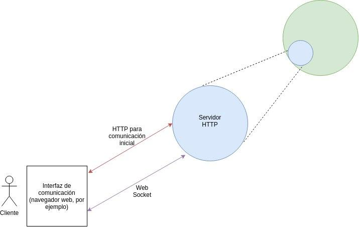
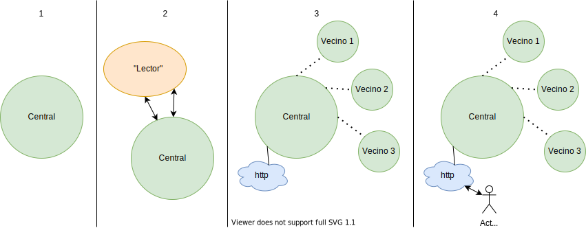

# Proyecto integrador Redes-Oper

Repositorio para el proyecto integrador de Redes y Sistemas Operativos  

## Descripción general
El proyecto consiste en crear una red virtual sobre una red física, en donde sea posible enviar mensajes entre nodos. 
Los nodos de la red virtual serán procesos que podrán enviar mensajes entre nodos virtuales que estén montados sobre la misma máquina real, y entre nodos virtuales que estén montados en diferentes máquinas reales.

Cada nodo verde (proceso) dispone de un nodo naranja, el cual es el encargado de dar la información a cada nodo verde sobre él y sus vecinos.

También existen los nodos rosados, que se encargan del movimiento de los procesos, el nivel de congestionamiento, enrutamiento, etc.

Por otra parte, los nodos azules son los servidores web que permiten una comunicación adecuada entre los actores y los nodos verdes. Los actores pueden enviar y recibir mensajes por el buscador web que utilicen.
## Fase 1

La visión de esta fase consiste en leer la topología de la red y enviar mensajes sencillos (con un tamaño máximo de 200 bytes) entre un nodo verde y cualquiera de sus vecinos inmediatos (por ahora no vamos a saltar entre nodos). Este nodo que lo recibió lo envía a su nodo azul (servidor), para luego usualmente ser enviado a un cliente mediante una interfaz (navegador web).

### Nodos verdes y naranjas

El nodo verde es el nodo principal de esta estructura. Nace sin nombre y sin información de su entorno, por lo que debemos proveérselos para iniciar alguna comunicación. Este nodo realiza un "fork", creando así un nuevo nodo, siendo este etiquetado como "nodo naranja", con un pipe de entrada y uno de salida con el nodo verde original (comunicacion ida y vuelta). El nodo naranja lee dos archivos con el ID (número de identificación) y los vecinos del nodo verde (incluyendo ID, puerto y direccion IP de cada uno), se lo hace saber al nodo verde través del pipe, para que luego el nodo verde envíe al naranja una respuesta de vuelta, como indicando una recepción exitosa o algo parecido. Cuando esto ocurre el nodo naranja muere (exit).

Luego se establece un servidor de comunicación del nodo verde con sus respectivos vecinos, asi como un servidor para la comunicación con los clientes, los cuales llamaremos "nodos azules", de los que se hablará en brevedad. Con esto se puede ver que son diferentes las fuentes de información (paquetes) que pasan únicamente por un mismo nodo verde, por lo que la organización y correcto direccionamiento de esta es de vital importancia.

La comunicación con los vecinos verdes se realizará mediante el protocolo UPD. Se establece un puerto para que los vecinos de dicho nodo sepan por donde deben comunicarse. El nodo necesita la dirección IP del vecino al que quiere comunicarse, asi como su puerto, y los vecinos necesitan saber el puerto del nodo que empezó la comunicación. Por ahora no será necesario comprobar si el vecino existe o no, o si está o no conectado, ya que el protocolo UDP cuenta con la ventaja de permitir que los paquetes se pierdan en caso de que no haya un destinatario.

### Nodos azules

Los usuarios serán capaces de enviar y recibir mensajes por los nodos verdes a través de una interfaz (un navegador web, por ejemplo). Mediante el protocolo HTTP el navegador se comunica con un servidor HTTP que "se encuentra en el nodo verde", o dicho de otra forma, funcionan a través de este. Estos servidores serían los llamados "nodos azules".

Usualmente la comunicación entre la interfaz y el cliente se lleva a cabo con solicitudes y respuestas HTTP, pero para una comunicación mas "ágil" o simple, se usará algo llamado "web socket". Esto no significa que no se requiera de HTTP para establecer la comunicación inicial (recursos básicos como archivos html, css y javascript), pero a partir de ese punto el resto de comunicacion y paso de mensajes se puede realizar con el web socket.

***
**El orden cronológico en el que los hosts empiezan a funcionar es el siguiente:**

1. Se crea el host central (nodo verde).
2. Se genera mediante un fork el nodo naranja, este debe leer los datos de los nodos verdes vecinos.
3. El nodo naranja envía la referencia de los nodos vecios (direcciones ip y puertos udp correspondientes) al host principal, luego muere mientras se genera el nodo azul.
4. El usuario se comunica con el nodo azul por medio del protocolo http y sockets web.

***

## Dudas

- Cómo se comunican el servidor y el nodo verde?

- Es necesario usar fork obligatoriamente?

- Por qué el nodo verde no puede leer él mismo los archivos?

- Que se crea primero, el servidor o la conexión con los nodos verdes?

## Integrantes

- Juan José Herrera Rodríguez
- Johel Phillips Ugalde
- Isaac Herrera
- Diego Barquero Quesada
