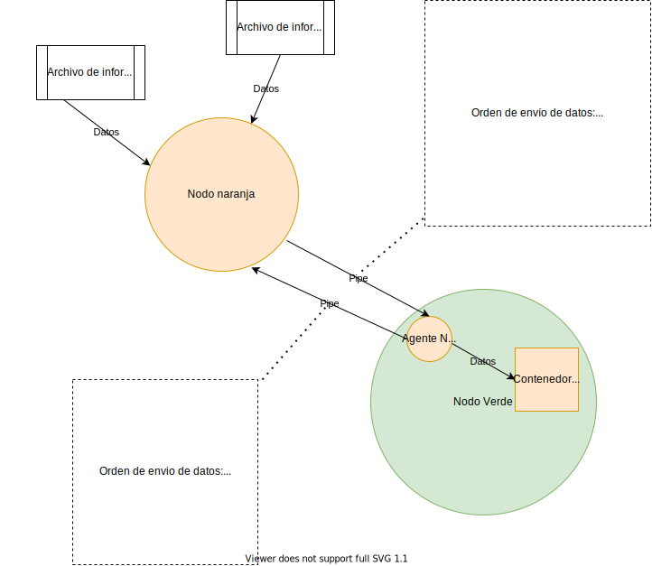
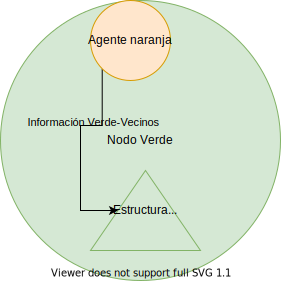

# Diseño Fase 1 Pandemic Plan Remastered

## a y b) Proceso naranja y agente naranja en verde

Primero el nodo verde crea el hilo correspondiente al agente de comunicación con el nodo naranja, el cual aún no ha sido creado. Una vez que el agente de comunicación con el nodo naranja ha sido creado, este crea un nuevo proceso, que será el nodo naranja.

El agente de comunicación del nodo naranja creará un contenedor para guardar los datos que reciba del nodo naranja. En la primera posición del contenedor estarán los datos correspondientes a un número de 2 bytes, que será el nuevo nombre del nodo verde y el número de puerto UDP que va a utilizar el nodo verde para comunicarse con otros nodos verdes. En las demás posiciones del contenedor estarán: un número de 2 bytes que corresponde a el número de cada vecino, el ip adonde se va a buscar el vecino y el número de puerto en el cuál los vecinos van a esperar a el nodo verde.

El agente de comunicación del nodo naranja establece el pipe de entrada y el pipe de salida con el nodo naranja. El nodo naranja también establece su pipe de entrada y salida con su agente en el nodo verde.

Ahora, el agente naranja va a enviar por su pipe de salida un 100 para que el nodo naranja sepa que va a tener que recibir su pid. Cuando el nodo naranja lo reciba por su pipe de entrada, le enviará al agente naranja un 101 por su pipe de salida al agente naranja, para indicarle que ya tiene su pid.

La organización que tendrá el archivo de información del nodo verde es la siguiente:

- Nombre del nodo verde (2 bytes)
- Número de puerto del nodo verde (menor a 65536)

La organización que tendrá el archivo de vecinos es la siguiente:

- Nombre del primer vecino (2 bytes)
- Número de puerto del primer vecino (menor a 65536)
- IP del primer vecino (únicamente IPv4)
- ...
- Nombre del último vecino (2 bytes)
- Número de puerto del último vécino (menor a 65536)
- IP del último vecino (únicamente IPv4)

El agente naranja va a enviar por su pipe de salida un 102 para que el nodo naranja sepa que va a tener que enviarle el nombre del nodo verde y su número de puerto. El nodo naranja va a proceder a leer del archivo de información del nodo verde para obtener toda su información, línea por línea. Cada línea de información del nodo verde será enviada por el pipe de salida del nodo naranja al pipe de entrada del agente naranja. Esta información es alamcenda por el agente naranja en la primera posición del contenedor. Cuando el nodo naranja termine le enviará un 103 por su pipe de salida al agente naranja, el agente sabrá que ya tiene los datos del nodo verde.

Seguidamente, el agente naranja va a enviar por su pipe de salida un 104 para que el nodo naranja sepa que va a tener que enviarle el número de cada vecino del nodo verde, el ip adonde se va a buscar el vecino y el número de puerto en el cuál los vecinos van a esperar a el nodo verde. El nodo naranja va a proceder a leer del archivo de información de los vecinos para obtener la información de cada vecino, línea por línea. La información de cada vecino será almacenada en las siguientes posiciones del contenedor. Cuando el nodo naranja termine de enviar la información de un vecino que no es el último, le enviará un 105 por su pipe de salida al agente naranja; el agente sabrá que ya tiene los datos de un vecino del nodo verde y que los siguientes datos serán de otro vecino verde. Cuando el nodo naranja termine de enviar toda la información, le enviará un 106 por su pipe de salida al agente naranja; el agente sabrá que ya tiene todos datos de los vecinos del nodo verde.

Una vez que el nodo naraja reciba el código 107 por parte del agente naranja, ese proceso terminará. El agente naranja va a proceder a enviar la información del contenedor a un contenedor que pueda ser compartido por los demás agentes que están en el nodo verde. Cuando este hilo concluya con ese fin, terminará.

## c) Capa de aplicación

El principal objetivo de la capa de aplicación será conectar el servidor HTTP con los clientes, para que estos puedan enviar solicitudes que serán atendidas por el servidor.

### 1. Servidor azul

Mediante sockets HTTP, el servidor recibirá solicitudes de los clientes HTTP asociados a él. Si la solicitud inicial del cliente, la cual se encarga de establecer una comunicación cliente-servidor, es correcta, el servidor responderá con un mensaje similar, haciendo constar que la comunicación se ha establecido.

### 2. Cliente azul

Es el usuario que inicia la “conversación” con el servidor HTTP azul. El cliente es quien pide recursos del servidor mediante una solicitud HTTP a través de un socket. El cliente utiliza un navegador desde su máquina (host) para realizar estas solicitudes.

### 3. Agente azul en verde

Es el encargado de crear el servidor HTTP, por el cual se transmiten los mensajes o solicitudes, tanto de los clientes como del servidor. Cada nodo verde contará con su respectivo agente azul, por lo que se contará con tantos servidores HTTP como nodos verdes, multiplicando a su vez la cantidad de clientes. También se encarga de redireccionar los mensajes provenientes de los vecinos verdes hacia el servidor de su nodo verde, en caso de que un cliente encontrado en otro servidor quiera enviar un mensaje a uno de los clientes de su servidor HTTP asociado.

## d) Capa de enlace de datos

Esta capa está involucrada en cada entrada y salida de datos para cada uno de los nodos de la topología. Es esencial para la comunicación entre hosts.

### 1. Envío de datos a cada vecino verde

Para el envío de datos a los vecinos de un nodo verde se va a inicializar un       hilo por cada uno de los vecinos del nodo verde y cada uno de estos hilos conoce los datos del vecino al cual están conectados para que así, si algún cliente desea enviar un mensaje a cliente que se encuentre conectado en otro nodo verde, este sea capaz de llegar mediante dicha conexión.

### 2. Recepción de datos de vecinos verdes

Para la recepción de los datos el nodo verde genera un hilo el cual se va a encargar de recibir los mensajes que envían sus vecinos y redireccionar estos mensajes, ya sea al cliente destino ubicado en su servidor HTTP, o a alguno de sus otros vecinos verdes.

## e) Interacción entre componentes a nivel del nodo verde

El hilo principal del nodo verde se encarga de generar otros hilos los cuales  van a tomar el rol de agentes comunicadores entre los otros procesos que se conectan al nodo verde.Se va a generar un hilo que funcione como agente comunicador con el nodo naranja, un hilo que se conecta con el servidor web y diferentes hilos para cada vecino que tenga el nodo verde. Los hilos(agentes) comparten memoria para poder intercambiar sus datos.

